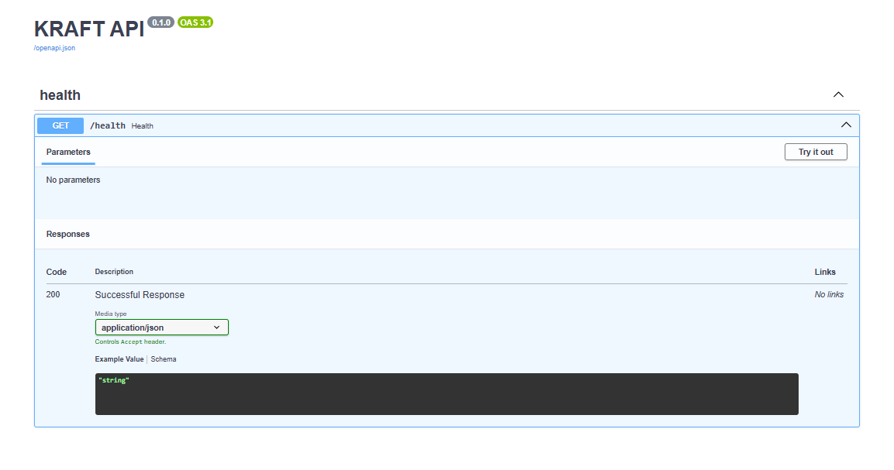
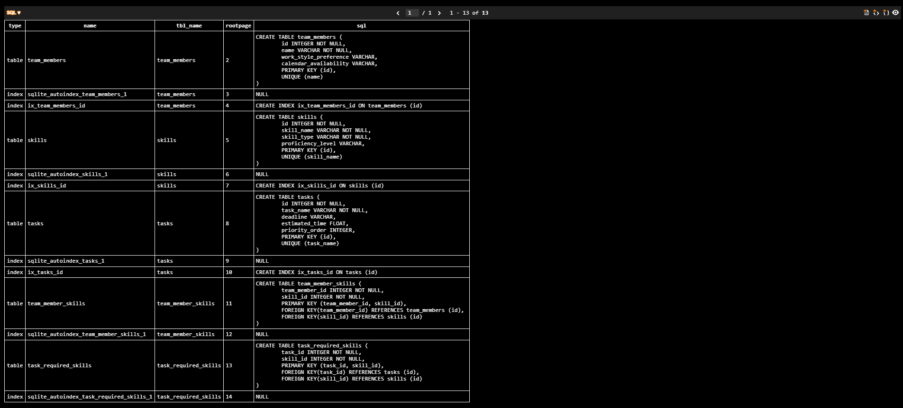
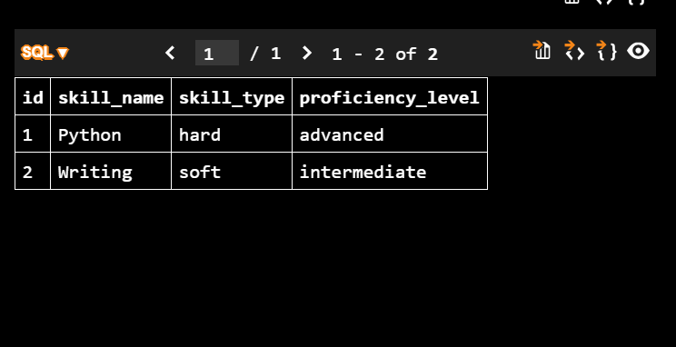
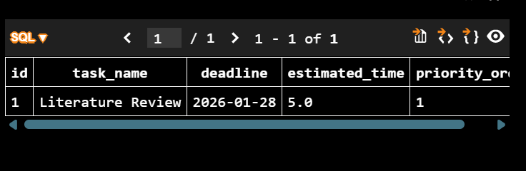
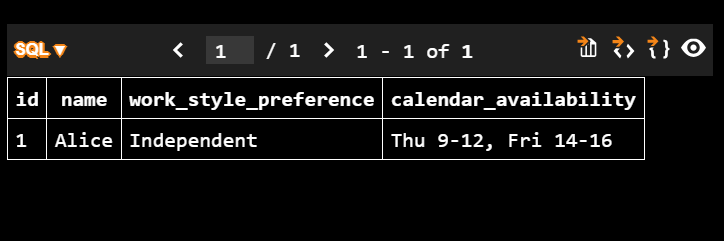

# KRAFT — Team Setup & Run Instructions

This repository is structured for a clean team workflow with a stable frontend scaffold and an upcoming FastAPI backend.

---

## Table of Contents
1. [Repository Structure](#repository-structure)
2. [Environment Setup](#environment-setup)
3. [Frontend Setup](#frontend-setup)
4. [Backend Setup](#backend-setup)
5. [Running Together](#running-together)
6. [Database Setup](#database-setup)
7. [Troubleshooting](#troubleshooting)
8. [Collaboration Rules](#collaboration-rules)

---

## Repository Structure

The project maintains a clear separation of concerns:

```
MSAI-371-Enigma/
├── frontend/          # React + TypeScript + Vite + Tailwind UI
├── backend/           # FastAPI backend
├── docs/              # Documentation (setup, contributing, plans)
└── scripts/           # Helper scripts for teammates
```

---

## Environment Setup

### Windows Environment Checker Script

Before running anything, verify that all required tools are installed using the provided environment checker.

**File:** `scripts/check_versions.ps1`

**Steps:**
1. Open PowerShell from the repository root
2. Enable script execution (run once):
   ```powershell
   Set-ExecutionPolicy -Scope CurrentUser -ExecutionPolicy RemoteSigned
   ```
3. Run the version checker:
   ```powershell
   .\scripts\check_versions.ps1
   ```

**Expected Output:**
- Git version
- Python version
- Node version
- npm version

---

## Frontend Setup

### Tech Stack
- React + TypeScript + Vite
- TailwindCSS (v4)
- React Query (configured)
- Professional UI scaffold in `src/App.tsx`

### Pre-configured Files
- `frontend/tailwind.config.js`
- `frontend/postcss.config.js`
- `frontend/.env.example`
- React Query Provider setup in `frontend/src/main.tsx`

### Getting Started

**Step 1: Navigate to frontend directory**
```bash
cd frontend
```

**Step 2: Install dependencies**
```bash
npm install
```

**Step 3: Create local environment file**

Windows (PowerShell):
```powershell
copy .env.example .env
```

Mac/Linux:
```bash
cp .env.example .env
```

**Step 4: Start the development server**
```bash
npm run dev
```

✅ **Frontend runs at:** `http://localhost:5173`


---

## Backend Setup

### Tech Stack
- FastAPI
- SQLite database
- Uvicorn server

### Getting Started

**Step 1: Navigate to backend directory**
```bash
cd backend
```

**Step 2: Create and activate virtual environment**

Windows (PowerShell):
```powershell
py -m venv .venv
.venv\Scripts\activate
```

Mac/Linux:
```bash
python3 -m venv .venv
source .venv/bin/activate
```

**Step 3: Install dependencies**
```bash
pip install -r requirements.txt
```

**Step 4: Create local environment file**

Windows (PowerShell):
```powershell
copy .env.example .env
```

Mac/Linux:
```bash
cp .env.example .env
```

**Step 5: Start the backend server**
```bash
uvicorn app.main:app --reload
```

✅ **Backend runs at:** `http://localhost:8000`

✅ **API documentation (Swagger):** `http://localhost:8000/docs`

✅ **Health check endpoint:** `http://localhost:8000/health`



---

## Running Frontend + Backend Together

For local development, run both servers simultaneously in separate terminals.

**Terminal 1 (Backend):**
```bash
cd backend
.venv\Scripts\activate
uvicorn app.main:app --reload
```

**Terminal 2 (Frontend):**
```bash
cd frontend
npm run dev
```

Both services will now communicate locally during development.

---

## Database Setup

### SQLite Database

The database is stored locally as a file at `backend/kraft.db`.

### How the Database is Created

The SQLite database file is automatically created when the backend starts for the first time:

```bash
cd backend
.venv\Scripts\activate
uvicorn app.main:app --reload
```

Once the backend runs successfully, you should see the file `backend/kraft.db` created in the backend directory.

### Verify Database Connection via API

After starting the backend, test the database using these endpoints:

**Health check:**
```
http://127.0.0.1:8000/health
```

**Database ping (checks DB + lists tables):**
```
http://127.0.0.1:8000/db/ping
```

**Example response:**
```json
{
  "db": "ok",
  "tables": ["allocation_runs", "allocations", "roles", "skills", "task_dependencies", "task_required_skills", "tasks", "team_member_skills", "team_members", "time_slots"]
}
```

### View and Query Database in VS Code

**Step A: Install SQLite Extension**

1. Open VS Code Extensions (Ctrl + Shift + X)
2. Search for "SQLite"
3. Install **SQLite** by alexcvzz

**Step B: Open the Database**

1. Press `Ctrl + Shift + P`
2. Select `SQLite: Open Database`
3. Choose `backend/kraft.db`
4. You should now see **SQLITE EXPLORER** in the left sidebar

**Step C: Browse Tables**

In the sidebar, expand `kraft.db` → `Tables`, then right-click any table (e.g., `team_members`) and select **Show Table** to view the data in a clean grid.



### Seed Demo Data (Optional)

By default, database tables may be empty. To insert lightweight demo rows locally for testing UI and table views:

```bash
cd backend
py seed.py
```

After seeding, tables like `team_members`, `time_slots`, `tasks`, and `skills` will contain sample data.

**Demo Data Previews:**







### Database Collaboration Notes

- The SQLite database file is **local-only** and should **not** be pushed to GitHub
- Each teammate can generate their own `kraft.db` by running the backend
- `backend/kraft.db` is ignored in `.gitignore`

---

## Troubleshooting

### PowerShell Script Execution Issues

**Problem:** `.ps1` scripts won't run

**Solution:** Enable script execution in PowerShell (run once):
```powershell
Set-ExecutionPolicy -Scope CurrentUser -ExecutionPolicy RemoteSigned
```

Then retry:
```powershell
.\scripts\check_versions.ps1
```

### Node/npm is Missing

**Problem:** Node.js or npm not found

**Solution:**
1. Install Node.js LTS from https://nodejs.org/
2. Restart your terminal
3. Verify installation:
   ```bash
   node --version
   npm --version
   ```

### Database Not Creating

**Problem:** `kraft.db` file not created after starting backend

**Solution:**
1. Ensure you're in the `backend/` directory
2. Virtual environment is activated
3. Check that `uvicorn` started successfully (no errors in console)
4. Try the `/health` endpoint to verify backend is running
5. Try the `/db/ping` endpoint to verify database connection

---

## Collaboration Rules (Important)

**DO:**
- ✅ Work on your own branch
- ✅ Keep frontend work inside `/frontend`
- ✅ Keep backend work inside `/backend`
- ✅ Use pull requests into `dev` branch before merging to `main`

**DON'T:**
- ❌ Commit `.env` files to the repository
- ❌ Push directly to `main` branch
- ❌ Commit the `backend/kraft.db` file

---

## Quick Reference

| Task | Command |
|------|---------|
| Check environment | `.\scripts\check_versions.ps1` |
| Run frontend | `cd frontend && npm install && npm run dev` |
| Run backend | `cd backend && python -m venv .venv && .venv\Scripts\activate && pip install -r requirements.txt && uvicorn app.main:app --reload` |
| Seed database | `cd backend && py seed.py` |
| View API docs | Visit `http://localhost:8000/docs` |